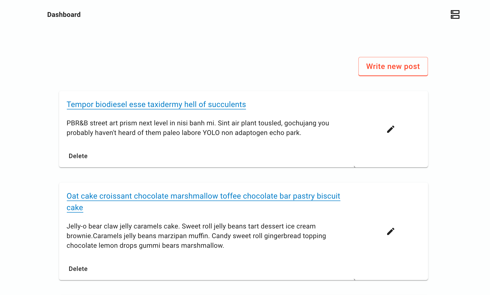
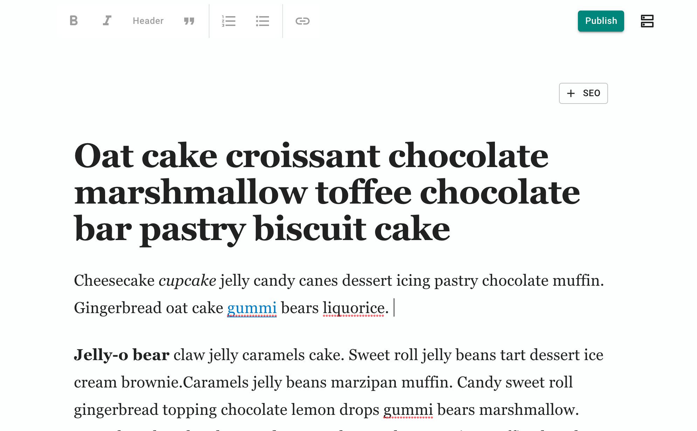

## Zenlify: Git-based microblog plugin for Gatsby.

Zenlify turns your Gatsby git repo into a complete blogging platform.  Edit markdown contents with the built-in distraction-free editor.

 
 

## How it works

Inspired by other git-based CMS toolkits (TinaCMS, NetlifyCMS) Zenlify reads and commits contents directly to your **git** repo.  Zenlify goal is to improve the writing experience. It is not a CMS.

1.  Add Zenlify to your Gatsby blog project.
  (TBD)
2.  Run  `gatsby develop`.  Access dashboard and editor at http://localhost:8000/admin
3.  Start writing!
4.  Git push your changes.

**Live demo**
https://clever-banach-ab222b.netlify.com/admin

Note: you won't be able to save/publish because the dashboard needs to connect to a local git repo. 
